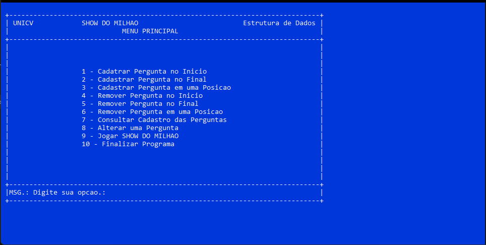
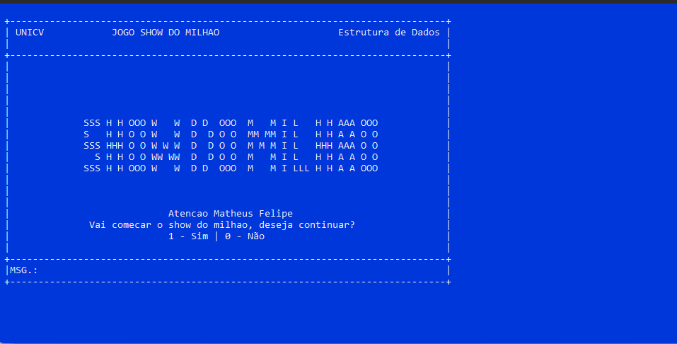
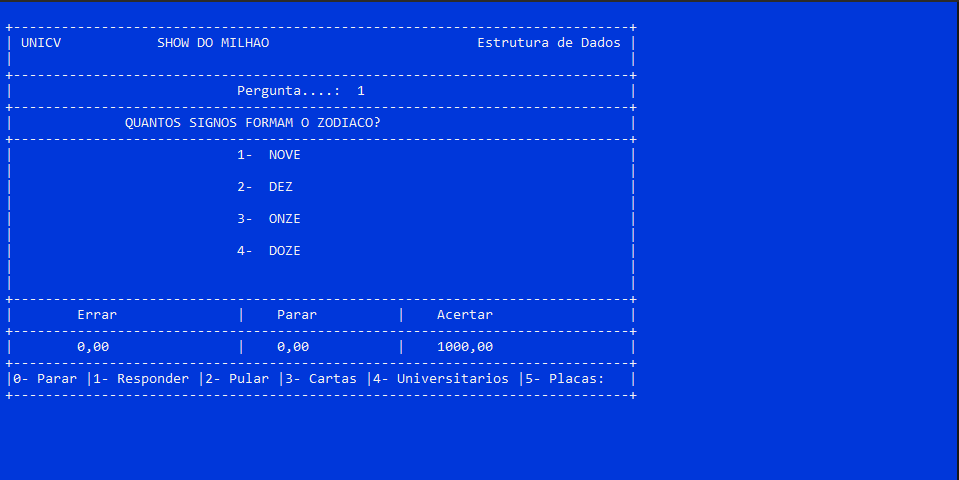
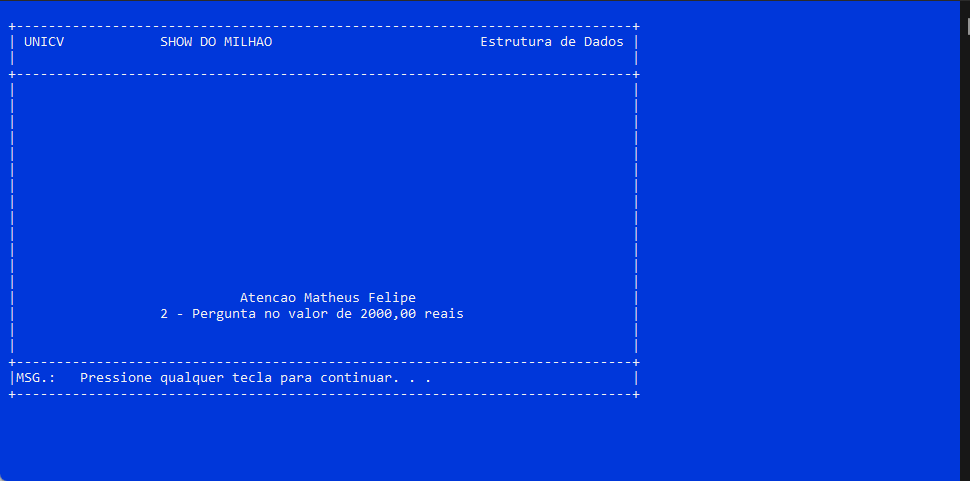

# Show do Milhão

## Descrição
Projeto desenvolvido para representar Show do Milhão (inicialmente Jogo do Milhão) que é um game show brasileiro de perguntas e respostas exibido pelo SBT, que concede um prêmio máximo de um milhão de reais.

Tal projeto foi entregue como trabalho final para a matéria de Estrutura de Dados do curso de Análise e desenvolvimento na UNICV.

## Tecnologias utilizadas

          
## Testando a aplicação

1. Baixe ou clone o repositório em sua máquina local
2. Entre dentro da pasta __/bin__
3. Execute o arquivo __trabalho_final.exe__
4. Escolha a opção para jogar o Show do Milhão 